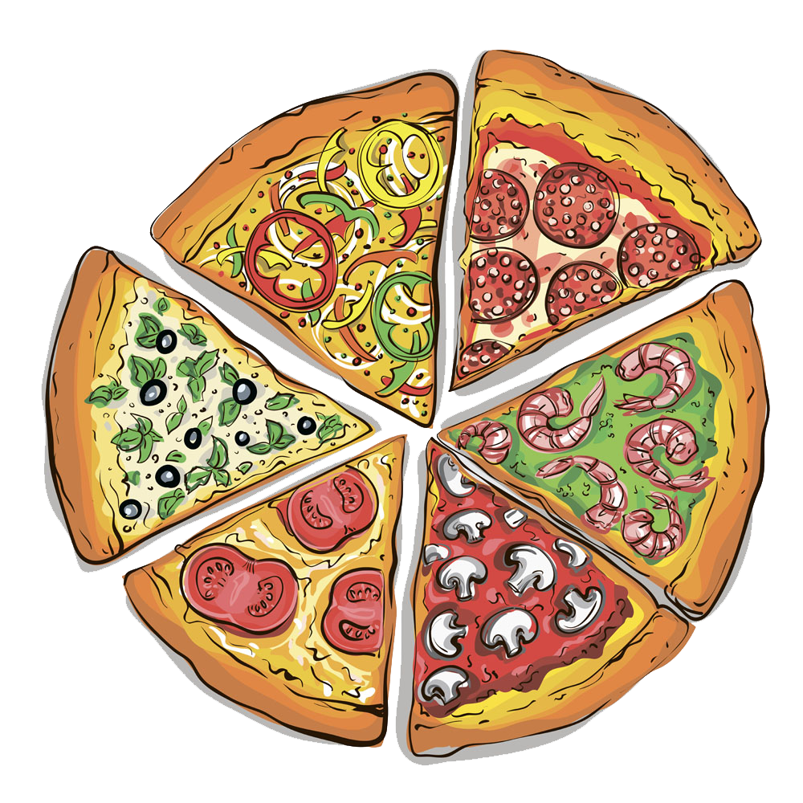

# Pizza Delivery

This fun project is based on this tutorial:
https://www.youtube.com/watch?v=7d2UMAIgOLQ
 
 

The project was about:
- how to use Entity Framework
- use MVC
- choose an item to buy / make custom item --> submit and the app calculates final cost
- add and use database
